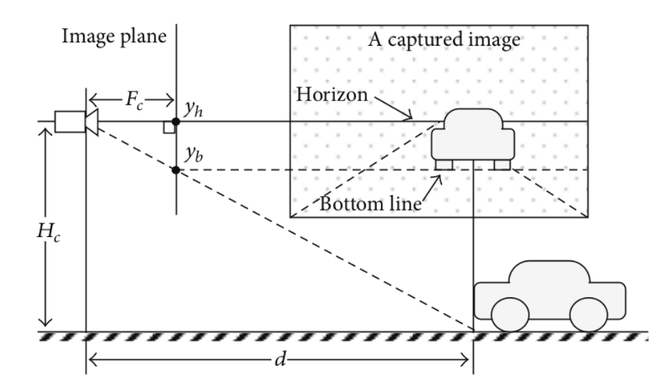

In-vehicle Driving Quality Monitoring
===============
### Robotics and Intelligent Vehicle Automation Lab (RIVAL)

- Built by Dong Chen, Zhaojian Li from Michigan State University
- Started on Oct.19, 2019, Lastly updated on Dec.03, 2019

Overview
-------

This project aims at building a on-device APP used to asist human drivers. This APP combines three basic functions: object detection(vehicle, 
traffic light, stop sign, pedestrain), lane deviation warning and distance estimation.

#### Motivation:
To be added...

Part1. Project Built Offline
-------

### Object Detection Module
We use the deep learning methods to do object detection. To be specific, we use the [YOLO-v3]( https://pjreddie.com/darknet/yolo/) model to do object detection, here we are only curious about traffic-related objects, such as vehicles, pedestrain, traffic lights and stop signs.
<p align="center">
     
     <br>Architecture of Yolo-v3 model
</p>


### Lane Deviation Module
Considered limited computing resources on mobile devices (smart phones), we adapt the convential computer vision methods. 


Modification logs:
- [x] Delete the display code for "intermediate pipeline images".
- [x] Simiplify codes.
- [ ] Problems with road curvature and offset values are always positive.

### Distance Estimation Module
47o FOV len.

<p align="center">
     
     <br>Distance Estimation
</p>
When camera pitch angle is negligibly small, range d to vehicle can be calculated as in the following: 

```
    d = F_c * H_c / (y_b - y_h)
```

### Demos:
For privacy issues, there are few open resources for dash camera videos. We will show our application by three different video demos.
- Stop sign detection

     [video link](https://www.youtube.com/watch?v=jctnZcWk2uQ)

- Traffic light detection

     [video link](https://www.youtube.com/watch?v=7ZbgyEO9cro)

- Lane deviation detection

     [video link](https://www.youtube.com/watch?v=kqG6j8lDm84)

### Reference
1. [YOLOv3: An Incremental Improvement](https://pjreddie.com/media/files/papers/YOLOv3.pdf)
2. [What’s new in YOLO v3?
](https://towardsdatascience.com/yolo-v3-object-detection-53fb7d3bfe6b)
3. [Integration of Vehicle Detection and Distance Estimation using Stereo
Vision for Real-Time AEB System](https://www.scitepress.org/Papers/2017/62967/62967.pdf)
4. [Robust Range Estimation with a Monocular Camera for Vision-Based Forward Collision Warning System](https://www.hindawi.com/journals/tswj/2014/923632/)
5. [Advanced Lane Finding](https://github.com/ndrplz/self-driving-car/tree/master/project_4_advanced_lane_finding)
6. [Lane Departure Warning System for Autonomous Driving](https://github.com/JunshengFu/driving-lane-departure-warning)


Part2. Project Built On Android
-------

To be added...
### Reference
1. [Yolo on iOS](https://github.com/ultralytics/yolov3)
2. [Mobileye Camera Development Kit](https://autonomoustuff.com/product/mobileye-camera-dev-kit/)

